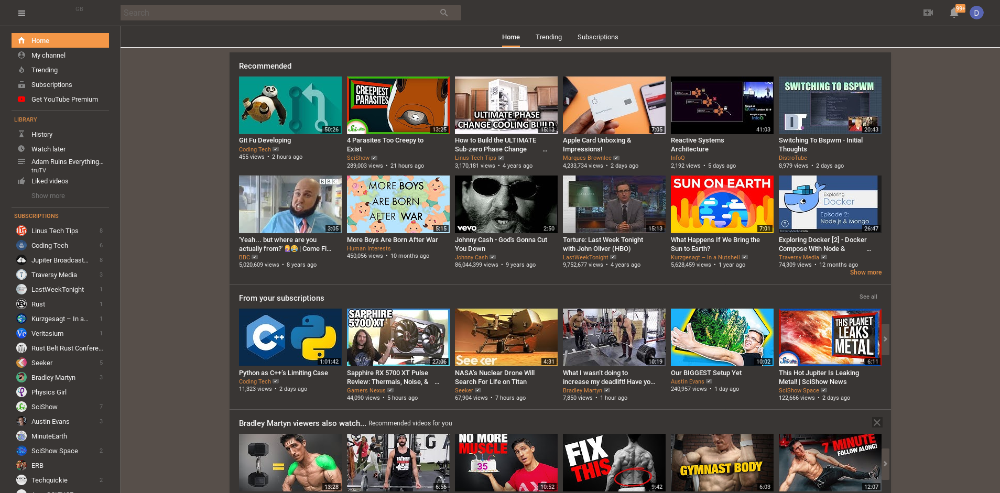

# Pop-on-Arch
Repository to make a Pop!_OS clone on arch with the KDE desktop environment

## Installation

1. Place ./aurorae/Pop in ~/.local/share/aurorae/themes (create the directory if it doesn't exist)

2. The colorscheme goes in `~/.kde/share/apps/color-schemes`

3. Finally, activate both themes by setting the colors and window decorations from your system settings.

4. If you are using Arch Linux 
```sh
yay -S pop-gtk-theme-bin
yay -S pop-icon-theme-bin
```
otherwise
```sh
cd icon-theme
meson build
sudo ninja -C "build" install
cd ../gtk-theme
make clean
make
sudo make install
```

5. Make Vscode Pop!_OS'ed
* Launch VS Code Quick Open (Ctrl+P), paste the following command, and press enter.
```sh
ext install ArtisanByteCrafter.poptheme
``` 

6. Make Youtube Pop!_OS'ed
* install `enhancer for youtube`  extensions
* Go to `enhancer for youtube` settings
* Click on Custom Theme under Theme
* Copy youtube.css into the

## Recommendations for a unified look:
  * Fira Sans Book size 10 font for General, Small, Toolbar, and Menu
  * Fira Sans SemiBold size 10 for Window Title
  * FiraCode of Fira Mono size 11 for Fixed width
  * If using Latte Dock, remove panel shadow and set panel background to opaque
  * Use the [gruvbox](https://github.com/morhetz/gruvbox-contrib) colorscheme for Konsole and text editors

Feel free to submit bugs if anything looks out of place.

## Screenshots




## Credits 
[Nadim Edde Gomez](https://github.com/Nequo/Pop-plasma-theme) for colorscheme and plasma theme
