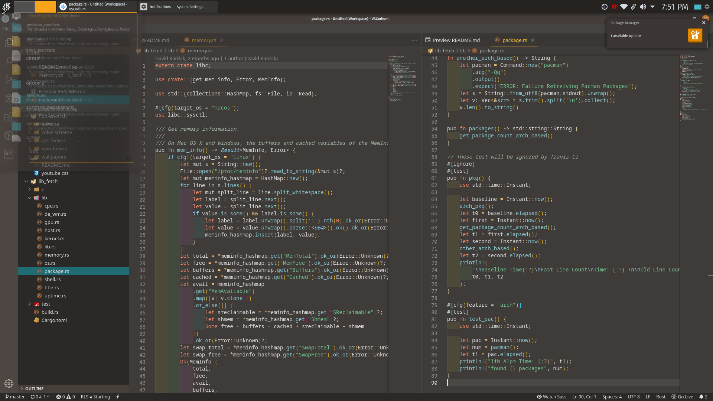

# Pop-on-Arch
Repository to make a Pop!_OS clone on arch with the KDE desktop environment

## Installation

### 0. Clone this Repo
```sh
https://github.com/Th3Whit3Wolf/Pop-on-Arch.git
```

### 1. Pop!_OS Plasma Theme
```sh
cp -r /aurorae/Pop ~/.local/share/aurorae/themes # You may need to create the directory
```

### 2. Pop!_OS Colorscheme 
```sh
cp  color-scheme/Pop\ Dark.colors ~/.kde/share/apps/color-schemes/
```

### 3. Pop!_OS Icon and GTK Theme
```sh
yay -S pop-gtk-theme-bin
yay -S pop-icon-theme-bin
```
otherwise
```sh
cd icon-theme
meson build
sudo ninja -C "build" install
cd ../gtk-theme
make clean
make
sudo make install
```

### 4. Pop!_OS Grub Theme
```sh
cd grub-theme
sudo cp /etc/default/grub.d/grub-pop-disable-splash.cfg  /etc/default/grub.d/grub-pop-disable-splash.cfg # You may have to create the /etc/default/grub.d directory
sudo cp -r /usr/share/grub/themes/pop /usr/share/grub/themes/
```
edit `/etc/default/grub`
find line begging with `GRUB_THEME

change it to 
```sh
GRUB_THEME="/usr/share/grub/themes/pop/theme.txt"
```

Then update grub with..
```sh
grub-mkconfig -o /boot/grub/grub.cfg
```

### 5. Pop!_OS Splash Screen
```sh
cp -r pop-splash/Pop ~/.local/share/plasma/look-and-feel/
```
* Go into settings
* Click Look and Feel
* Select Pop-Os

### 6. Pop!_OS Wallpapers
```sh
sudo cp -r wallpapers/ /usr/share/wallpapers/Pop
```

### 7. Pop!_OS Konsole Colorscheme
```sh
cp Pop.colorscheme ~/.local/share/konsole/
```

### 8. Make Vscode Pop!_OS'ed
* Launch VS Code Quick Open (Ctrl+P), paste the following command, and press enter.
```sh
ext install ArtisanByteCrafter.poptheme
``` 

### 9. Make Youtube Pop!_OS'ed
* install `enhancer for youtube`  extensions
* Go to `enhancer for youtube` settings
* Click on Custom Theme under Theme
* Copy youtube.css into the

### 10. Recommendations for a unified look:
  * Fira Sans Book size 10 font for General, Small, Toolbar, and Menu
  * Fira Sans SemiBold size 10 for Window Title
  * FiraCode of Fira Mono size 11 for Fixed width
  * If using Latte Dock, remove panel shadow and set panel background to opaque

Feel free to submit bugs if anything looks out of place.

## Screenshots
vscode


youtube


desktop


splash screen


## Credits 
[Nadim Edde Gomez](https://github.com/Nequo/Pop-plasma-theme) for colorscheme and plasma theme

[Pop!_OS Wallpapers](https://github.com/pop-os/wallpapers)

[Pop!_OS GTK Theme](https://github.com/pop-os/gtk-theme)

[Pop!_OS Icon Theme](https://github.com/pop-os/icon-theme)

[Pop!_OS Grub Theme](https://github.com/pop-os/grub-theme)


### Bonus
I am unable to run it on my hardware as plymouth flicker free boot is unsupported by dedicated graphics
[Pop!_OS Plymouth Theme](https://github.com/pop-os/plymouth-theme)