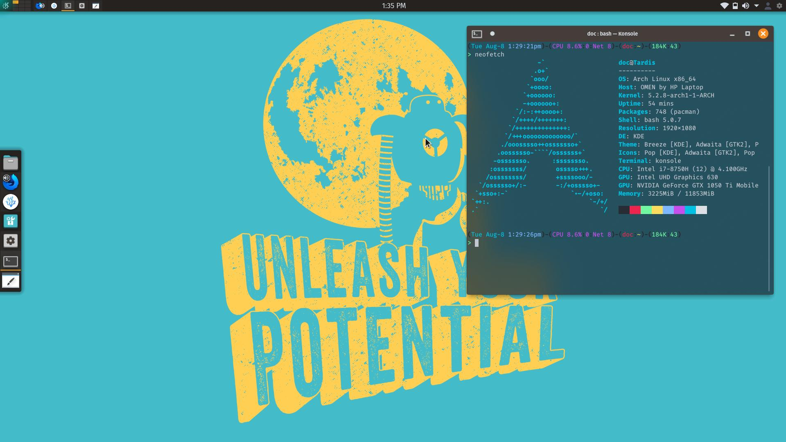

# Pop
This is a KDE Look and Feel Theme(with a splash screen) to make KDE look and feel like Pop!_OS.

### Screenshots
#### Desktop

#### Splash

# Credits
[Pop!_OS Plymouth](https://github.com/pop-os/plymouth-theme) is where I got the pop icon that fits so well.

[Pop!_OS Gtk Theme](https://github.com/pop-os/gtk-theme) is where I got the colors from.
